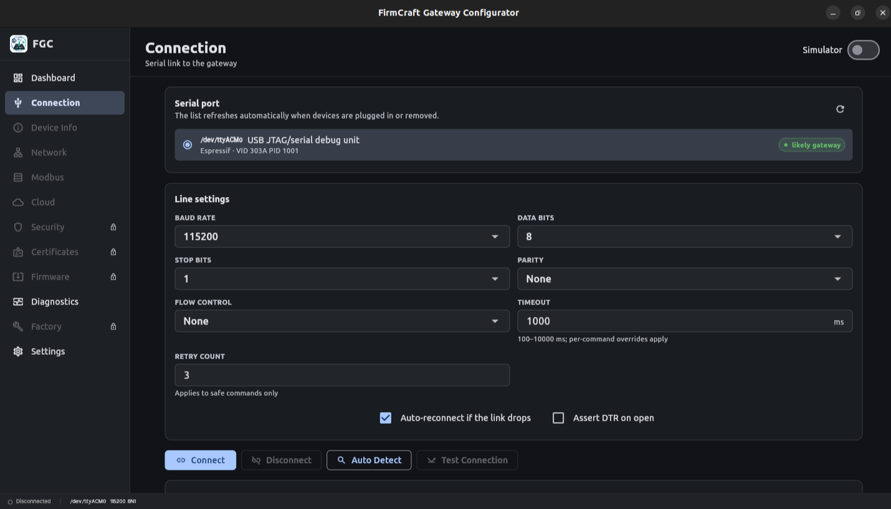
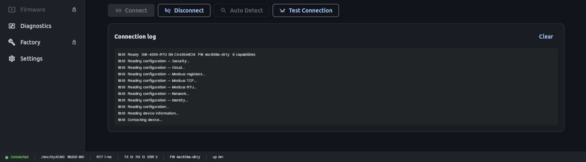
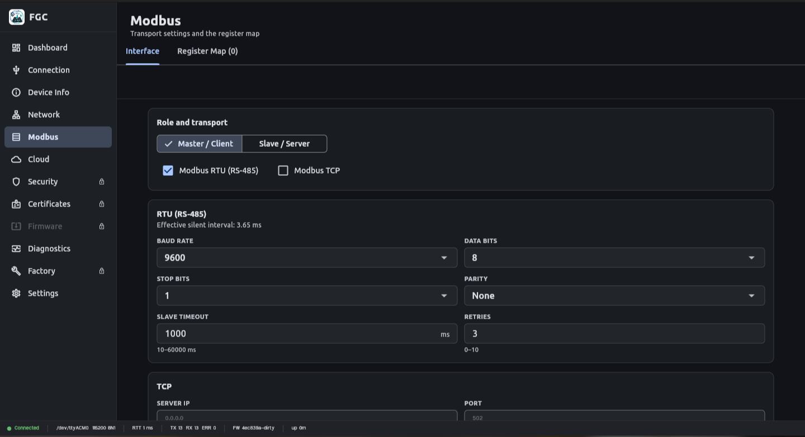
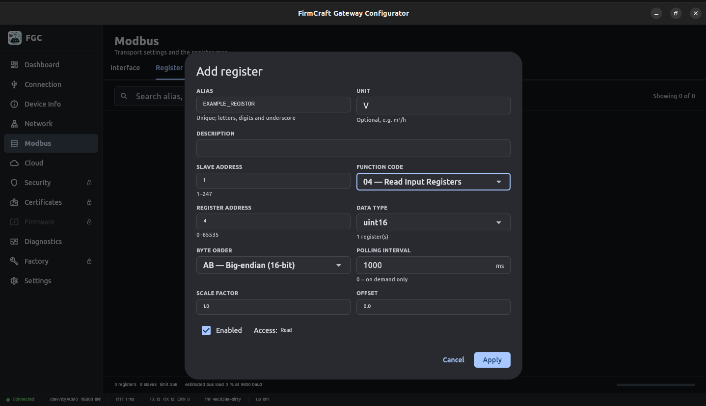
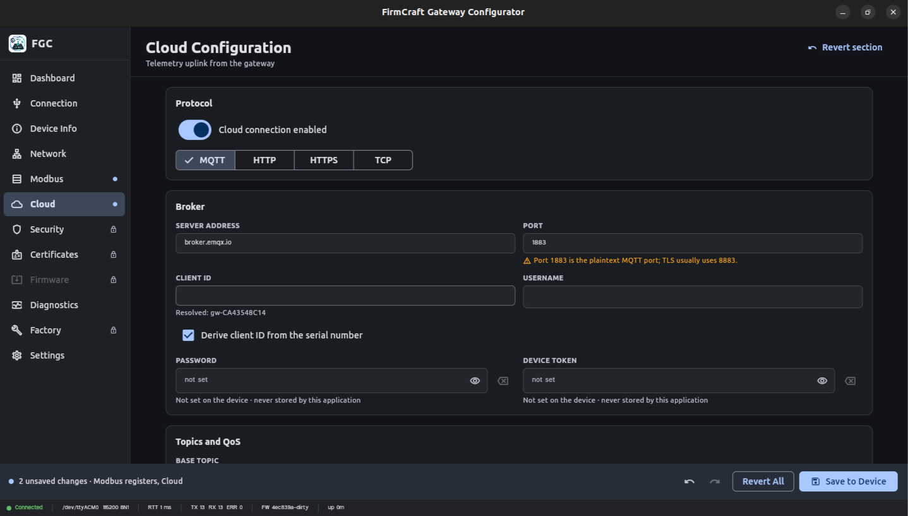
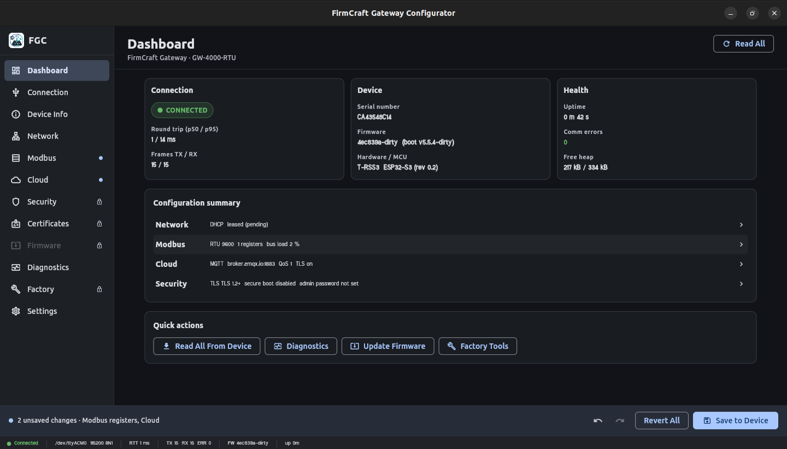

# Gateway Application

This repository contains the Gateway application for **Windows** and **Linux**.

## Files

```text
windows/
├──  fc-gw-config-stand-alone.rar

linux/
├── firmcraft-gateway-configurator_1.0.0_amd64.deb
```

---

# Installation Guide

## Windows Installation

1. Download `fc-gw-config-stand-alone.rar`.
2. Extract the archive using WinRAR or 7-Zip.
3. Open the extracted folder.
4. Run `gateway_configurator.exe`.

---

## Linux (Ubuntu/Debian)

1. Open a terminal.
2. Navigate to the `linux` folder.
3. Install the package:

```bash
sudo apt install ./firmcraft-gateway-configurator_1.0.0_amd64.deb
```

4. Start the application from the Applications menu or by using the appropriate command.

---
## Overview

The Gateway Application enables communication between Modbus RTU devices and the cloud.

---

## 1. Launch the Application

Open the Gateway Application.

## Connection




## steps to connect

1. Connect the gateway to your computer using a USB cable.
2. Launch the **FirmCraft Gateway Configurator**.
3. Open the **Connection** page from the left navigation menu.
4. Select the detected **Serial Port**.
5. Configure the serial communication parameters:

| Parameter | Recommended Value |
|-----------|-------------------|
| Baud Rate | 115200 |
| Data Bits | 8 |
| Stop Bits | 1 |
| Parity | None |
| Flow Control | None |
| Timeout | 1000 ms |
| Retry Count | 3 |

6. (Optional) Enable **Auto-reconnect if the link drops**.
7. Click **Connect**.



If the connection is successful:
- The status bar at the bottom will display **Connected**.
- Additional configuration pages such as **Device Info**, **Network**, **Modbus**, and **Cloud** become available.

## 2. Configure Modbus



1. Select the Role and Transport.
2. Select the Baud Rate.
3. Select Data Bits.
4. Select Parity.
5. Select Stop Bits.
5. Enter Slave Timeout and Retries.

---

## 3. Register Map


Click **+ADD** to add the Registers
1. Enter the Slave ID.
2. Select the Function Code.
3. Enter the Register Address in Decimal Value.
4. Select the Data Type,Byte Order.
5. Enter Polling interval,Scale factor and Offset.
6. Click **Apply**.

Click **Save to Device**.
---

## 4. Configure Cloud



Enter the following information:
- Select Protocol
- Server Address
- Port
- Client ID
- Username
- Password
- Publish Topic
- Subscribe Topic

Click **Save to Device**.

---

##  Dash Board Page

Once connected successfully.



---

